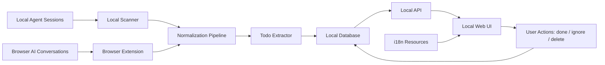

# AI Todo PRD

> Repository name: `ai-todo`
> Product name: **AI Todo**
> Status: Draft for review
> Default language: English

## 1. Executive Summary

### Problem Statement

Users now work across coding agents, browser-based AI assistants, and project tools. Important unfinished work often remains buried inside agent conversations, browser AI chats, tool errors, and partial outputs, making it difficult to know what still needs attention.

### Proposed Solution

AI Todo is a local-first todo extraction tool for AI workflows. It scans local agent sessions, captures browser AI conversations, extracts unfinished tasks, stores them in a local database, and displays them in a simple local web UI. v1 focuses on a clear loop: collect sources, incrementally extract todo candidates, show evidence, keep the interface localization-ready, and let the user mark items as done, ignored, or deleted.

### Success Criteria

- Extract at least **20 candidate todos from 50 recent agent sessions** in an internal test dataset.
- At least **50% of extracted todos are judged useful** by human reviewers.
- Support **incremental scanning** so already-processed sessions are not duplicated.
- Local web UI loads **500 todos within 2 seconds** and exposes all core UI strings through localization resources.
- Every todo item includes at least **one evidence reference**: source app, timestamp, conversation snippet, file path, URL, or error log.

## 2. User Experience & Functionality

### User Personas

| Persona | Description | Primary Need |
|---|---|---|
| AI-heavy builder | Uses coding agents, browser AI assistants, and local tools for project work | Know what tasks were left unfinished across sessions |
| Product or research collaborator | Uses ChatGPT, Claude, and browser research for project planning | Turn long AI conversations into actionable follow-ups |
| Local-first power user | Prefers local data processing and explicit review | Avoid uploading private conversations to a cloud todo tool |
| Open-source maintainer | Reviews AI-generated PRs, issues, and docs | Understand feature scope and unfinished work quickly |

### User Stories

#### Story 1: View extracted todos locally

As a user, I want to open a local web page and see unfinished AI-generated tasks so that I can continue work without rereading every conversation.

Acceptance Criteria:

- The user can open a local URL, default `http://127.0.0.1:<port>`, and see a todo list.
- Each todo shows title, source, status, timestamp, evidence, and suggested next step.
- The UI supports filtering by status: `waiting_for_user`, `agent_blocked`, `partial_done`, `needs_review`, and `stale_thread`.
- The UI does not require cloud login for v1.
- The UI uses externalized strings so future localization does not require business logic changes.

#### Story 2: Incrementally scan local agent sessions

As a user, I want AI Todo to scan new local agent conversations over time so that the todo list stays current without manual import.

Acceptance Criteria:

- The local daemon records the last processed session timestamp or session ID.
- Re-running the scanner does not create duplicate todos for previously processed items.
- The scanner supports at least one local agent source in v1.
- Scan results are persisted in a local database.

#### Story 3: Capture browser AI conversations

As a user, I want the browser extension to capture relevant browser AI conversations so that web-based work can also become todos.

Acceptance Criteria:

- Browser extension can capture visible conversation turns from at least one supported AI web app in v1.
- Captured content includes source URL and capture timestamp.
- Captured URL is stored as evidence, not treated as the todo content itself.
- Browser capture writes into the same local todo pipeline as local agent scans.

#### Story 4: Clean up extracted todos manually

As a user, I want to mark todos as done, ignored, or deleted so that the list does not become noisy.

Acceptance Criteria:

- User can mark a todo as `done`.
- User can mark a todo as `ignored`.
- User can delete an extracted todo from the active list.
- Done and ignored items remain available in an archive view or local database state.

#### Story 5: Review evidence before acting

As a user, I want every todo to show why it was extracted so that I can trust the result.

Acceptance Criteria:

- Each todo includes a short evidence snippet or structured evidence reference.
- Evidence includes at least source name and timestamp.
- If available, evidence includes file path, local session path, URL, command error, or conversation excerpt.
- The system must not create a todo without evidence.

#### Story 6: Keep AI Todo localization-ready

As an open-source maintainer, I want the interface copy to be externalized so that future localization can be added without rewriting product logic.

Acceptance Criteria:

- English is the default language for public docs and default UI.
- Core UI labels, status names, empty states, and action buttons are loaded from localization resources.
- User language preference support is designed but not required to be fully implemented in v1.
- Extracted todo content preserves the original conversation language by default.
- Status labels and action labels are localized without changing stored enum values.

### Non-Goals

- No cloud sync in v1.
- No team workspace or permissions system in v1.
- No proactive notifications or active interruption in v1.
- No automatic writing into Feishu, Slack, Discord, Telegram, Linear, Jira, or external todo tools in v1.
- No broad personal memory workspace in v1.
- No automatic modification of source conversations or agent logs.
- No requirement to support every agent source in the first release.
- No machine translation of full conversation history in v1.
- No requirement for every documentation page to be fully translated in v1; core README and core UI are required first.

## 3. AI System Requirements

### Tool Requirements

| Tool or Component | Required for v1 | Purpose |
|---|---:|---|
| Local session scanner | Yes | Read local agent conversations and tool logs |
| Browser extension | Yes | Capture browser AI conversations and webpage context |
| Local daemon | Yes | Run scans and serve local API/UI |
| Local database | Yes | Store todos, sources, evidence, status, and scan checkpoints |
| Local web UI | Yes | Display and manage extracted todos |
| LLM classifier | No (v1.1) | Classify unfinished work and generate summaries — deferred to v1.1; v1 uses the rule-based extractor |
| Rule-based extractor | Yes | Provide deterministic baseline extraction and fallback |
| i18n resource system | Yes | Store UI copy outside business logic |
| Connector interface | Yes | Define a generic connector contract for future Feishu, Slack, Discord, Telegram, and local app integrations |
| Connectors for Slack, Discord, Telegram | No | Not required as working integrations in v1 |

### Todo Extraction Taxonomy

| Status | Meaning | Example Signal |
|---|---|---|
| `waiting_for_user` | Agent is waiting for user input, confirmation, or authorization | "Please confirm", "choose one option", "I need access" |
| `agent_blocked` | Agent failed because of tool, dependency, permission, network, or runtime issue | command failed, permission denied, missing API key |
| `partial_done` | Work has a draft or intermediate result but no final completion evidence | generated draft, not tested, not exported, not submitted |
| `needs_review` | Agent produced something that requires human review | PR, feature doc, design option, implementation proposal |
| `stale_thread` | Conversation indicates later continuation but has no recent progress | "continue later", "tomorrow", old unresolved session |

### Evaluation Strategy

v1 evaluation must use a labeled internal dataset.

| Evaluation Item | Method | Pass Target |
|---|---|---|
| Candidate usefulness | Human review of 20 extracted todos | >= 50% useful |
| Evidence quality | Reviewer checks whether evidence explains extraction | >= 90% todos have understandable evidence |
| Duplicate rate | Re-run scanner on same dataset | <= 5% duplicate todos |
| Status accuracy | Compare predicted status to human label | >= 70% exact match |
| Noise tolerance | Reviewer marks items as annoying or irrelevant | <= 30% annoying/irrelevant |
| Localization coverage | Check user-facing UI strings | 100% core UI strings externalized |
| Localization readiness | Review UI string ownership | No core UI strings hardcoded in business logic |

Testing dataset:

- Minimum 50 local agent sessions.
- Minimum 10 browser AI conversations.
- Include successful sessions, failed sessions, partial sessions, and review-needed sessions.
- Include at least 5 sessions that should produce no todo, to test false positives.
- Include conversations in more than one language when testing language handling.

## 4. Technical Specifications

### Architecture Overview

Core components:

| Component | Responsibility |
|---|---|
| Local scanner | Read supported local agent logs and sessions |
| Browser extension | Capture visible browser AI conversation content and source metadata |
| Normalization pipeline | Convert different sources into a common session format |
| Todo extractor | Generate candidate todos with status, summary, and evidence |
| Local database | Persist todos, evidence, scan state, and user actions |
| Local API | Serve todo data to the UI and accept status updates |
| Web UI | Let users view, filter, complete, ignore, delete, and inspect evidence |
| i18n resources | Provide UI strings without changing business logic |

### Data Model

Minimum tables or collections:

| Entity | Required Fields |
|---|---|
| `sources` | `id`, `type`, `name`, `path_or_url`, `enabled`, `last_scanned_at` |
| `sessions` | `id`, `source_id`, `external_id`, `started_at`, `updated_at`, `raw_ref`, `hash` |
| `todos` | `id`, `session_id`, `title`, `summary`, `status`, `confidence`, `state`, `created_at`, `updated_at` |
| `evidence` | `id`, `todo_id`, `kind`, `text`, `path`, `url`, `timestamp` |
| `scan_checkpoints` | `source_id`, `cursor`, `last_success_at`, `last_error` |

Todo `state` values:

- `active`
- `done`
- `ignored`
- `deleted`

### Integration Points

| Integration | v1 Status | Notes |
|---|---|---|
| Local agent sessions | v1 | First source: Codex session logs |
| Browser AI conversation | v1 | First source: browser AI-site capture (existing extension) |
| Cursor local history | Future | Local storage format needs research |
| Generic connector interface | Required in v1 | Define shape for future external tool integrations |
| Slack / Discord / Telegram | Future | Do not need working integration in v1 |
| Feishu | Future | Do not need working integration in v1 |

### Security & Privacy

- All v1 processing must run locally by default.
- The tool must not upload local sessions, browser captures, or todos to a cloud server in v1.
- Browser extension must show what sites it can access.
- Captured content must be stored in a local database.
- User must be able to delete extracted todos.
- Sensitive values such as API keys, tokens, and secrets must be redacted before display when detected.
- v1 uses rule-based extraction only and ships no LLM classifier. If an LLM is added (v1.1), its provider, model, and data flow must be explicitly documented.

### Localization Requirements

- English is the default public language for README, repository metadata, issue templates, and release notes.
- The app must separate stored enum values from displayed labels. Example: store `agent_blocked`, display "Agent blocked" in the current UI language.
- All core UI strings must live in localization resources, not hardcoded in components.
- Core UI includes navigation, todo status labels, action buttons, empty states, settings, source labels, and error messages.
- Extracted todo titles and summaries should preserve the source conversation language by default.
- Future machine translation can be considered after v1, but it is not required for v1.
- User-facing labels must avoid technical jargon where possible.

## 5. Risks & Roadmap

### Phased Rollout

#### v1 / MVP: Local AI Todo

Goal: deliver the current core product scope plus the required launch constraints: local scanning, browser capture, local database, a simple lightweight todo-list web UI, manual cleanup, localization-ready UI, and open-source-ready documentation. Exact date: no hard public deadline — tracked internally, not a launch gate (confirmed 2026-06-17).

Scope:

- Local daemon scans at least one local agent source.
- Browser extension captures at least one browser AI source.
- Local database stores extracted todos and evidence.
- Incremental scanning prevents duplicate extraction across repeated runs.
- Local web UI displays active todos as a simple, lightweight list with status filtering. (The two-dimensional time × type workbench is deferred to v1.1.)
- User can mark todos as done, ignored, or deleted.
- Docs include `README.md`, `FEATURES.md`, `ARCHITECTURE.md`, `RULES.md`, and `ROADMAP.md`.
- Core UI copy is available through localization resources.
- Generic connector interface is documented for future Feishu, Slack, Discord, Telegram, and local app integrations.

#### v1.1: Better Accuracy and Review Flow

Scope:

- Improve status classification accuracy.
- Add source-level filters and confidence filters.
- Add archive view.
- Add copyable todo summary for PRs, issues, and docs.
- Add benchmark dataset and evaluation script.
- Add language preference persistence and improve localization documentation.
- Add the two-dimensional (time × type) workbench with history hidden by default.
- Add an optional LLM classifier (rule-based extraction remains the default and fallback).

#### v2.0: Connectors and Collaboration

Scope:

- Add Slack, Discord, Telegram, or Feishu connector options.
- Add issue-based community contribution workflow.
- Add optional external task export.
- Add richer localization documentation.
- Add optional translation of todo summaries while preserving original evidence.

### Technical Risks

| Risk | Impact | Mitigation |
|---|---|---|
| Local session formats change | Scanner breaks or misses todos | Keep source adapters isolated and versioned |
| Browser DOM changes | Extension capture fails | Maintain per-site adapters and diagnostics |
| Too many false positives | User loses trust | Default to high-confidence extraction and require evidence |
| Duplicate todos | List becomes noisy | Use session hash, evidence hash, and scan checkpoints |
| Privacy concerns | Users avoid tool | Local-first default, clear docs, deletion, redaction |
| LLM cost or latency | Extraction becomes slow or expensive | Use rule-based baseline and make LLM optional |
| PR review difficulty | Team cannot understand AI-generated changes | Require feature docs, clear commits, English PR summary, and human-written change notes |
| Localization drift | UI labels become inconsistent across resources | Keep status enums stable and require localization checks in tests |

### Open Questions

Resolved 2026-06-17 (confirmation worksheet: `docs/v1-scope-cn.md`):

- Initial technical stack: **Node.js local daemon + SQLite + browser extension + lightweight web UI**.
- First local agent source: **Codex**.
- First browser source: **browser AI-site capture** (existing extension).
- LLM classifier vs rule-based: **v1 is rule-based only**; the LLM classifier is deferred to v1.1.
- v1 deadline: **no hard public deadline** — tracked internally, not a launch gate.
- v1 UI scope: **a simple, lightweight todo list** with status filtering; the two-dimensional (time × type) workbench is deferred to v1.1.
