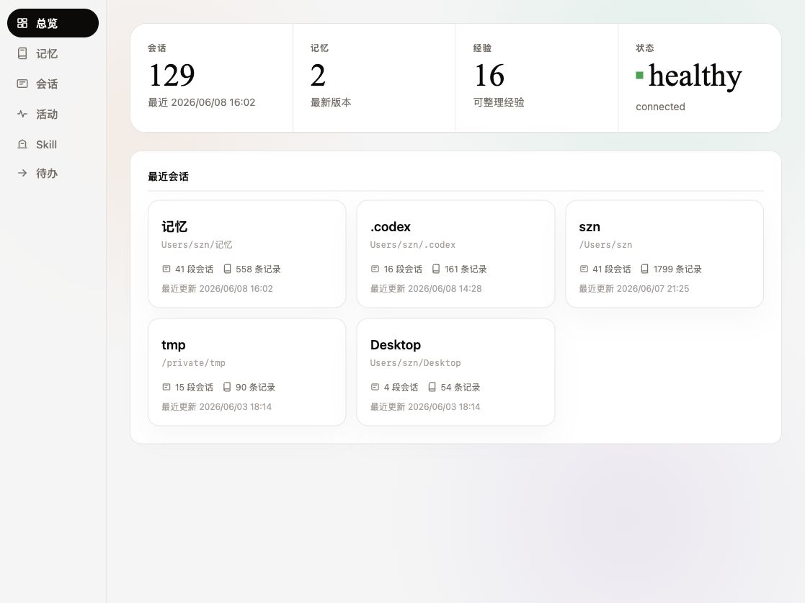
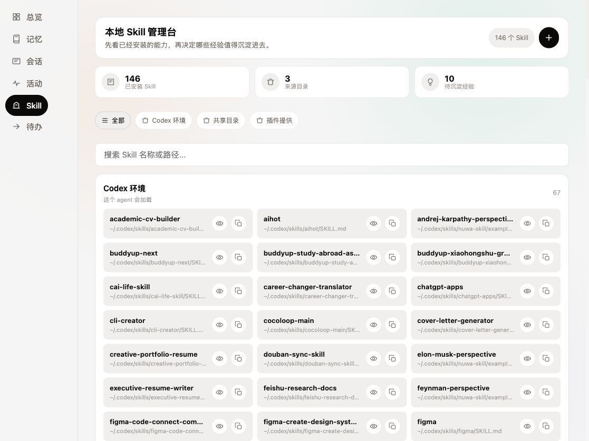

<p align="center">
  
</p>

# Agent Memory Lab

**一个本地优先的 Agent 记忆工作台。**

它把散落在浏览器、AI 对话、项目会话和本地 Skill 里的上下文整理成一套可审阅、可管理、可继续使用的工作记忆。

我们想解决的不是“保存一段聊天记录”，而是更现实的问题：你和不同 Agent、不同网页、不同项目反复协作之后，哪些信息应该留下来？哪些经验值得沉淀？哪些内容应该删掉？下次打开 Claude、ChatGPT、Cursor 或本地 Agent 时，它能不能更快接上你的工作流？

<p align="center">
  
</p>

## 它适合谁

- 长期和 AI Agent 一起做项目的人
- 想把 ChatGPT、Claude、Gemini、Perplexity 等网页对话变成可复用记忆的人
- 想管理本地 Skill、项目经验和个人偏好的人
- 想研究 Agent 记忆、跨工具上下文同步、本地优先工作流的人
- 不想把私人记忆直接交给云端系统的人

## 一句话工作流

浏览器插件负责捕捉上下文，本地 Viewer 负责审阅和管理，Skill / API / MCP 负责把记忆重新交给 Agent 使用。

```text
网页 / AI 对话 / 项目会话
        ↓
浏览器插件识别页面与候选记忆
        ↓
本地工作台审阅、编辑、删除、归类
        ↓
沉淀为记忆、经验、待办或 Skill
        ↓
下次 Agent 协作时继续使用
```

## 5 步试用路线

第一次打开项目时，可以先按这条路线跑通核心体验：

1. 先预览浏览器插件：`npm run preview:browser-extension`，打开 `http://localhost:3113/demo/browser-extension.html`。
2. 加载浏览器插件：Chrome / Edge → `chrome://extensions` → 开发者模式 → 加载 `browser-extension/`。
3. 在预览页输入一个问题，查看输入框附近的“记忆建议”。
4. 启动完整工作台：`npm run build && npm run start`，打开 `http://localhost:3113/#dashboard`。如果不确定服务是否正常，另开终端执行 `npm run check:workbench`。
5. 在 ChatGPT / Claude / Gemini / Perplexity 页面输入一个问题，检查真实站点是否识别输入框；再用插件把当前网页加入待审阅，回到 Viewer 的记忆库确认保存。

演示前可以按 [演示检查清单](docs/demo-checklist-cn.md) 自查。

## 为什么不是普通网页剪藏

普通剪藏工具更像“收藏夹”：保存标题、链接、正文，然后等你以后再找。

Agent Memory Lab 更像“工作记忆层”：它关心这段内容以后怎么被 Agent 使用。

| 普通收藏 | Agent Memory Lab |
| --- | --- |
| 保存网页 | 识别网页、AI 对话、项目文档和候选记忆 |
| 内容越多越好 | 先生成候选，再让用户审阅 |
| 面向人类回看 | 面向人和 Agent 共同复用 |
| 主要是资料库 | 同时管理记忆、经验、行动、Skill |
| 常依赖云端 | 默认本地优先 |

## 当前产品形态

### 1. 本地工作台

首页把最近会话、记忆、经验和项目状态集中到一个入口。你可以从这里进入会话时间线、记忆库、Skill 管理台和待办。

### 2. 浏览器插件

插件是新的重点入口。它会在浏览器里识别当前页面类型，例如：

- ChatGPT、Claude、Gemini、Perplexity、Grok 等 AI 对话页
- GitHub 项目、Issue、PR
- 飞书、Notion 等文档页
- 论文 / PDF
- 普通网页和插件商店页面

插件不会把所有东西直接塞进长期记忆，而是先生成候选，并送到记忆库顶部的“待审阅”队列：

- 这页可能值得保存成什么记忆
- 保存前可以在插件弹窗或同步侧栏里改标题和正文
- 这段内容可以沉淀成什么经验
- 当前页面有没有隐私风险
- 最近同步了哪些内容
- 在支持的 AI 页面输入问题时，输入框附近会出现“记忆建议”，展示相关记忆并支持插入/复制
- 选中网页片段或链接后，可用右键菜单送入同一套本地待审阅队列

插件结构参考了 OpenMemory / Mem0 这类跨 AI 产品记忆插件的做法：按 ChatGPT、Claude、Gemini、Perplexity 等 supported sites 维护独立配置，把记忆召回放到输入框附近。不同的是，Agent Memory Lab 不默认把网页内容直接写入长期记忆，而是统一送进本地待审阅队列，用户确认后才沉淀。详细对标见 [浏览器插件对标：Mem0 / OpenMemory 实现参考](docs/browser-extension-mem0-reference-cn.md)。

你确认后，它才会进入长期记忆或经验；不合适的候选可以直接忽略。

本地预览路径：

```text
Chrome / Edge -> chrome://extensions -> 开发者模式 -> 加载已解压的扩展程序 -> 选择 browser-extension/
npm run preview:browser-extension
http://localhost:3113/demo/browser-extension.html
```

插件权限与隐私说明见 [docs/browser-extension-privacy-cn.md](docs/browser-extension-privacy-cn.md)。外部试用指南见 [docs/external-tester-guide-cn.md](docs/external-tester-guide-cn.md)，发布门槛见 [docs/release-gates-cn.md](docs/release-gates-cn.md)。英文隐私政策草稿和商店发布文案见 [docs/browser-extension-privacy-en.md](docs/browser-extension-privacy-en.md) 与 [docs/browser-extension-store-listing-en.md](docs/browser-extension-store-listing-en.md)。如果需要打包给别人本地预览，可以运行 `npm run package:browser-extension`，产物包括 `artifacts/agent-memory-lab-extension.zip`、`artifacts/delivery-summary.md` 和 `artifacts/delivery-manifest.json`。

然后点击工具栏里的 Agent Memory Lab 图标，打开“同步侧栏”。

### 3. 会话时间线

会话页按时间展示历史协作过程。它不是只给一个摘要，而是尽量保留完整记录：用户说了什么、Agent 做了什么、工具调用发生在哪里、最后留下了哪些结果。

### 4. 记忆库

记忆页把原始记忆拆成更容易理解的卡片，例如身份档案、偏好、项目背景、经历和工作线索。拆分发生在展示层，不破坏底层原始记忆。

### 5. Skill 管理台

本地 Skill 越装越多之后，很容易不知道每个 Skill 来自哪里、用于什么、路径在哪里。Skill 管理台会扫描本机的 Codex、Agents 和插件 Skill 目录，把它们放到一个可搜索、可筛选、可查看详情的界面里。

可沉淀经验不会自动改写本地 Skill。你可以先从经验分组生成一份 `SKILL.md` 草稿，预览后再决定是否复制到某个 Skill 目录。

<p align="center">
  
</p>

当前支持：

- 搜索 Skill 名称和路径
- 按来源筛选 Skill
- 查看 `SKILL.md` 内容
- 复制本地路径
- 判断哪些经验适合继续沉淀进 Skill

### 6. 待办与经验

Agent 对话里经常会出现“之后要做”“这里卡住了”“这个方法下次还可以用”。工作台会把这些内容翻译成人能看懂的状态：待跟进、正在做、卡住了、已完成，并把可复用方法整理成经验。

## 项目结构

```text
browser-extension/      浏览器插件：网页与 AI 对话记忆同步入口
src/viewer/             本地可视化工作台
plugin/                 Agent 插件主体
plugin/skills/          remember / recall / recap / handoff 等 Skill
plugin/hooks/           Codex、Copilot 等 hook 配置
.codex-plugin/          Codex 插件市场配置
.claude-plugin/         Claude Code 插件市场配置
integrations/           OpenClaw、Hermes、filesystem watcher 等集成
docs/                   项目文档、飞书文档源文件和截图素材
```

## 快速开始

### 1. 安装依赖

```bash
npm install
```

### 2. 构建

```bash
npm run build
```

### 3. 启动本地服务

```bash
npm run start
```

默认 Viewer 地址：

```text
http://localhost:3113/#dashboard
```

检查完整工作台状态：

```bash
npm run check:workbench
```

它会检查 API、Viewer 和插件 demo 页是否可访问，并在端口被其他服务占用时给出下一步提示。

检查当前发布门槛：

```bash
npm run check:release-gates
```

公开发布前再运行：

```bash
npm run check:release-public
```

当前真实 AI 站点验收还未完成，所以公开发布检查会失败，这是预期的安全阀。

如果使用已发布包，也可以全局运行：

```bash
npm install -g @agentmemory/agentmemory
agentmemory viewer
```

## 本地数据

Agent Memory Lab 默认本地优先。记忆、会话、索引和插件设置都优先保存在本机，不需要额外部署数据库。

这让它适合处理更私人的工作流：个人偏好、项目上下文、会话复盘、本地 Skill、研究材料和实验性 Agent 记忆。

## 设计原则

| 原则 | 具体做法 |
| --- | --- |
| 少暴露内部概念 | 不把 graph、audit、frontier 等调试概念直接放到主导航 |
| 先让功能完整可见 | 记忆、会话、Skill、待办都可以直接进入 |
| 自动整理，但不替用户做最终决定 | 插件和会话生成候选，用户可以审阅、编辑、删除 |
| 图标优先，文字克制 | 导航和动作尽量用 icon 辅助理解，少堆解释 |
| 本地优先 | 适合私人记忆和长期项目实验 |

## 当前进度

已经完成：

- 中文图文 README
- Viewer 主导航简化
- 记忆卡片展示优化
- 会话完整时间线
- 本地 Skill 管理台
- 待办页人话化
- 浏览器插件 MVP
- 浏览器同步侧栏
- 待审阅记忆队列
- 记忆库来源筛选：浏览器、会话、手动
- AI 输入框附近的本地记忆提示
- 页面类型识别与候选记忆结构
- 飞书项目介绍文档素材

下一步重点：

- 更精确地抽取 ChatGPT、Claude、Gemini、Perplexity 等 AI 对话
- 保存前编辑候选记忆的标签、项目归属
- 把高频经验从草稿确认后沉淀进本地 Skill
- 跨 Agent 注入：在不同 AI 产品页面提示可用记忆

## 开发验证

```bash
npm test
npm run build
npm run check:delivery
```

`check:delivery` 会构建项目、检查浏览器插件、校验 README 截图和交付文档，并生成本地插件预览包。

本轮常用轻量验证：

```bash
npm test -- --run test/viewer-security.test.ts test/viewer-session-id.test.ts
npm test -- --run test/viewer-memories-sort.test.ts
```

## 来源说明

本项目基于 [rohitg00/agentmemory](https://github.com/rohitg00/agentmemory) 的本地记忆基础能力继续实验。当前分支聚焦中文本地工作台、浏览器记忆同步、交互体验和 Skill 工作流。

## 许可

Apache-2.0。详见 [LICENSE](LICENSE)。
