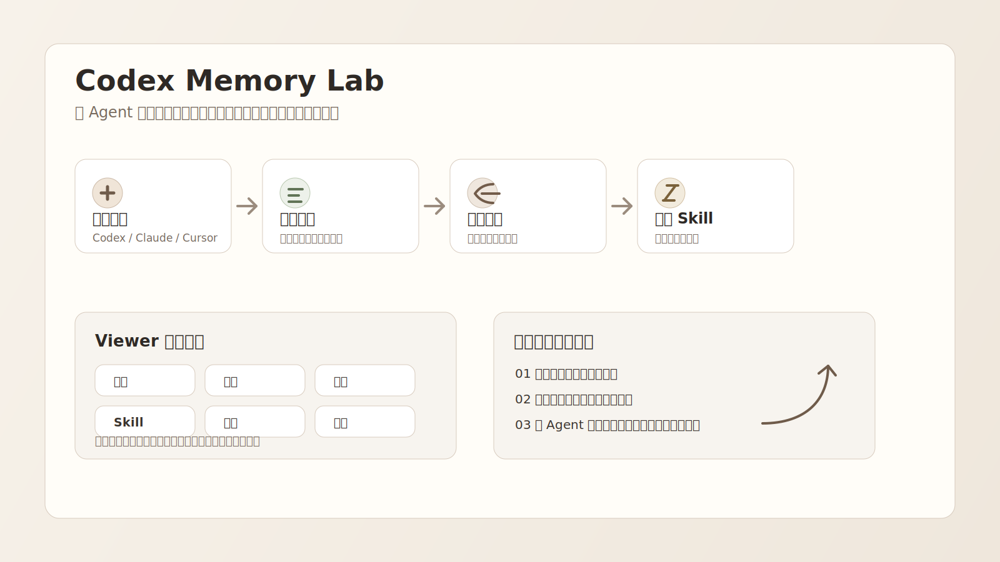

<p align="center">
  
</p>

# Codex Memory Lab

**一个本地优先的 Agent 记忆工作台：把聊天记录、项目上下文、个人偏好、可复用经验和本地 Skill 整理成能被 Agent 继续使用的工作记忆。**

它不是普通的聊天记录列表，也不是只给工程师看的日志面板。这个版本更关注一个问题：当你和 Codex、Claude Code、Cursor 这类 Agent 长期协作时，哪些内容应该被自动留下来，哪些内容应该被你审阅、编辑、删除、沉淀成 Skill？

<p align="center">
  
</p>

## 为什么做它

和 Agent 合作久了，真正麻烦的不是“让它回答一次问题”，而是这些事总是断掉：

| 工作里的断点 | 这个项目想解决的方式 |
| --- | --- |
| 每次都要重新解释我是谁、项目是什么 | 把稳定身份、偏好、项目背景沉淀为可审阅记忆 |
| 会话很多，但很难复盘某次到底发生了什么 | 用时间线展示完整会话过程，而不是只给摘要 |
| 做过很多 UI / 文档 / Skill 经验，但下次又忘 | 把可复用做法整理为“经验”，再合并进本地 Skill |
| 本地 Skill 越装越多，来源和用途不清楚 | 扫描本机 Skill，按 Codex / 共享目录 / 插件来源管理 |
| Agent 的待办和项目状态被埋在对话里 | 从会话里整理待跟进、正在做、卡住、已完成的行动 |

## 现在能看到什么

### 1. 总览：从最近工作进入细节

总览页把最近会话、记忆、经验、状态放在一个入口里。项目卡片可以点击进入对应会话，适合作为每天打开的工作台。

<p align="center">
  
</p>

### 2. 记忆库：自动整理，但保留人工审阅

记忆页会把原始记忆拆成更容易理解的卡片，例如身份档案、偏好、项目目标、经历。页面上的拆分只是展示层优化，不会破坏底层原始记忆。

适合做这些事：

- 查看 Agent 当前记住了什么
- 删除不该留下的内容
- 补充新的记忆线索
- 检查哪些记忆可以被下次会话继续使用

### 3. 会话：完整过程，而不是只看摘要

会话页按时间展示历史会话。点击某段会话后，可以看到用户输入、Agent 回复、工具调用和关键结果，适合复盘“为什么最后变成这样”。

### 4. Skill 管理台：管理本地能力

Skill 页会扫描本机的 Codex、Agents 和插件 Skill 目录，展示每个 Skill 的来源、路径和详情。

它目前支持：

- 搜索 Skill 名称和路径
- 按来源筛选：Codex 环境、共享目录、插件提供
- 查看 `SKILL.md` 详情
- 复制本地路径
- 把成熟经验继续沉淀进 Skill

### 5. 待办：把内部字段翻译成人能看懂的行动

原始 Agent 系统里常有 `frontier`、`priority`、`status` 这类字段，但直接暴露给用户会很难懂。这里把它们整理成更自然的状态：

| 状态 | 含义 |
| --- | --- |
| 待跟进 | 会话里出现了下一步，但还没开始 |
| 正在做 | 当前仍在推进的事项 |
| 卡住了 | 需要用户输入、权限、资料或外部状态变化 |
| 已完成 | 已经收尾，可以沉淀经验 |

### 6. 活动页：看见工作节奏

活动页用于观察最近工作密度和活动类型。现在会先加载本地会话，再补齐少量最近会话细节，避免页面像“卡住”一样等待。

<p align="center">
  
</p>

## 推荐工作流

更接近真实使用时，它像一个循环：

1. 你继续正常和 Codex / Claude Code / Cursor 对话。
2. 后台记录会话、工具调用、项目路径和关键上下文。
3. Viewer 里把这些内容整理成记忆、会话、行动、经验。
4. 你审阅重要内容，删掉不该保留的，补充缺失线索。
5. 重复出现的做法沉淀成 Skill，让下次 Agent 更快进入状态。

## 插件与集成

这个项目的核心不是单独打开一个网页，而是通过插件接入日常 Agent 工作流。

| 接入方式 | 适合场景 | 作用 |
| --- | --- | --- |
| Codex 插件 | Codex CLI / Codex Desktop | 记录会话、工具调用、任务完成、上下文线索 |
| Claude Code 插件 | Claude Code 长期项目 | 通过 hooks 和 MCP 连接记忆层 |
| OpenCode 插件 | OpenCode 工作流 | 捕捉命令和会话片段 |
| MCP Server | Cursor、Gemini CLI、Claude Desktop 等 | 让不同 Agent 通过 MCP 读写记忆 |
| REST API | 自定义本地工具 | 直接接入记忆、会话、审计、搜索能力 |

仓库中相关目录：

```text
plugin/                 通用插件主体
plugin/skills/          remember / recall / recap / handoff 等 Skill
plugin/hooks/           Codex、Copilot 等 hook 配置
.codex-plugin/          Codex 插件市场配置
.claude-plugin/         Claude Code 插件市场配置
plugin/opencode/        OpenCode 插件与命令
integrations/           OpenClaw、Hermes、pi、filesystem watcher 等集成
src/viewer/             本地可视化工作台
```

## 快速开始

### 1. 安装依赖

```bash
npm install
```

### 2. 构建

```bash
npm run build
```

### 3. 启动本地服务

```bash
npm run dev
```

默认会打开本地服务和 Viewer：

```text
http://localhost:3113/#dashboard
```

如果使用已发布包，也可以全局运行：

```bash
npm install -g @agentmemory/agentmemory
agentmemory viewer
```

## 数据放在哪里

这个项目默认是本地优先。记忆、会话和索引保存在本机，不需要额外部署数据库。

适合这些使用方式：

- 个人长期项目记忆
- Codex / Claude Code 协作复盘
- 本地 Skill 管理
- Agent 记忆产品原型研究
- 人工审阅的工作流沉淀

## 设计原则

这个分支的 UI 迭代遵循几个原则：

| 原则 | 具体做法 |
| --- | --- |
| 少暴露难懂概念 | 不把 graph、audit、frontier 等内部概念直接放到主导航 |
| 能用图标就少堆文字 | 导航和动作按钮优先使用 icon，文字只保留必要信息 |
| 先完整看见功能 | 记忆、会话、Skill、待办都要能完整进入，而不是藏在调试页 |
| 自动整理，但允许人工控制 | 记忆和经验来自会话，但用户可以审阅、编辑、删除 |
| 本地优先 | 默认在本机运行，适合私人工作流和实验 |

## 当前状态

这是一个面向 **Codex / Agent 记忆工作台** 的产品化实验分支，基于 Agentmemory 的本地记忆能力继续做 UI、交互和工作流迭代。

已经完成：

- 中文图文 README
- Viewer 主导航简化
- 记忆卡片展示优化
- 会话完整时间线
- 本地 Skill 管理台
- 待办页人话化
- 活动页加载体验优化
- 飞书项目介绍文档素材

下一步更适合继续做：

- 自动从当前聊天记录更新记忆
- 把“可沉淀经验”定期合并进 Skill
- 更清楚地区分“经验”和“结晶”
- 为非技术用户继续减少内部字段露出
- 增加一键导出 / 飞书同步 / 项目报告

## 开发验证

```bash
npm test
npm run build
```

本轮常用的轻量验证：

```bash
npm test -- --run test/viewer-security.test.ts test/viewer-session-id.test.ts
npm test -- --run test/viewer-memories-sort.test.ts
```

## 来源说明

本项目基于 [rohitg00/agentmemory](https://github.com/rohitg00/agentmemory) 的本地记忆基础能力继续实验，当前仓库聚焦中文本地工作台、交互体验和 Codex/Skill 工作流。

## 许可

Apache-2.0。详见 [LICENSE](LICENSE)。
